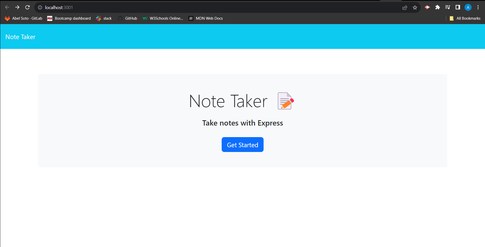
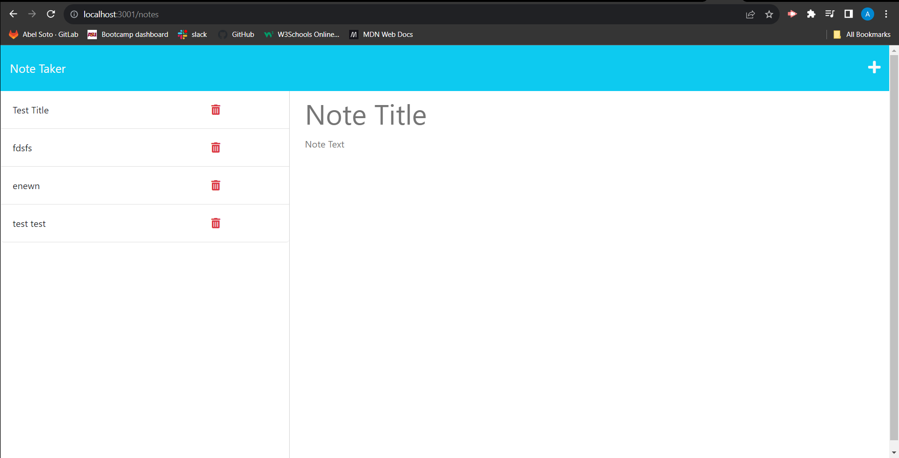

# note-taker

## Descrpition 
This project functions as a note taker. You can take write notes, save them, and refer to them at a different time. 

## Installation
To install this project, please ensure Node.js is installed on your computer. Once installed, clone this project's repository to your computer. Then open up the command line type "npm i" then "npm start". this will install the dependencies in the repo and also start the program.

## Usage 
Follow the instructions for installation or visit the projects live website at https://asoto225.github.io/note-taker/. Once on the websites landing page, click "Get Started" to enter a note. That will take you to the note input page. On this page you may enter a note title and note text, then save your note. Your note will then be populated on the left side for future use. 

## Screenshot

## License
[MIT](https://choosealicense.com/licenses/mit/)